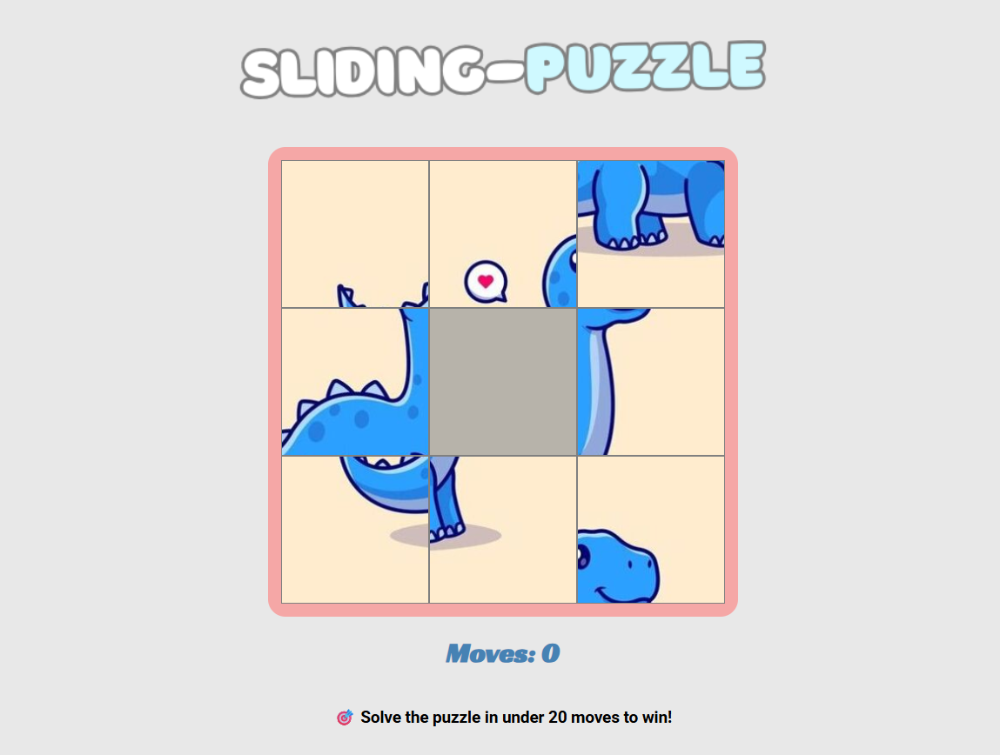

# Sliding Puzzle Game

## **Unit 1 project - Sliding Puzzle Game**

## 💡 How to Play

### 🎮 Game Instructions
- This is a **3x3 sliding tile puzzle** game.
- Your goal is to **rearrange the tiles** by dragging and dropping them until the original image or puzzle is correctly formed.
- You can only move a tile if it is **adjacent** (horizontally or vertically) to the blank tile.

---

### 🏆 Win Condition
- Solve the puzzle by forming the correct image **in 20 moves or fewer** to win.
- If you exceed 20 moves, you **lose the game**.

---

### 🔁 Restarting the Game
- After winning or losing, click **"Play Again!"** to reset the puzzle and try again.

